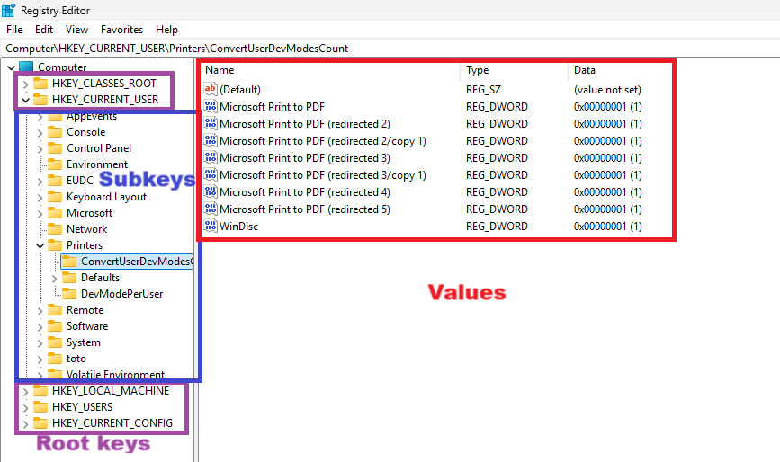

#############
WinReg
#############

The `scapy-winreg` module allows interaction with the Windows Registry over SMB using the MS-RRP protocol.
It supports various operations such as listing subkeys, reading and writing values, creating and deleting keys, and more.

********************
Some vocabulary
********************

In the context of the Windows Registry, it's important to understand the following terms:

* **Root key**: A root key, also called hive, is a container object in the registry that can hold subkeys and values. It's a key of the highest hierarchical level.
* **Subkey**: A subkey is a key that is nested within another key. It can also contain its own subkeys and values.
* **Key**: A key is a container object in the registry that can hold subkeys and values. It can designate both a root key and a subkey.
* **Value**: A value is a named item containing data and attached to a key. Each value has a name, a data type, and the actual data. Common data types include strings (REG_SZ), binary data (REG_BINARY), and DWORDs (REG_DWORD).



********************
Key functionnalities
********************

===================================
``use``: Select a root registry key
===================================

The ``use`` function allows you to select a root registry key to work with. 
The available root keys are:

* HKEY_CLASSES_ROOT (**HKCR**)
* HKEY_LOCAL_MACHINE (**HKLM**)
* HKEY_CURRENT_USER (**HKCU**)
* HKEY_USERS (**HKU**)
* HKEY_CURRENT_CONFIG (**HKCC**)
* HKEY_PERFORMANCE_DATA (**HKPD**)
* HKEY_PERFORMANCE_NLSTEXT (**HKPN**)
* HKEY_PERFORMANCE_TEXT (**HKPT**)

.. code-block:: bash
    :caption: CLI usage example

    >>> [reg] CHOOSE ROOT KEY\. > use HKLM
    >>> [reg] HKLM\. >

.. code-block:: bash
    :caption: Direct request from the command line

    >>> scapy-winreg  --UPN Administrator@DOM.LOCAL --password Passw0rd 10.0.0.10 --rootKey HKLM
    >>> [reg] HKLM\. >

====================
``ls``: List subkeys
====================

The ``ls`` function lists the subkeys of the current key or a specified relative key.

.. code-block:: bash
    :caption: CLI usage example

    >>> [reg] HKLM\. > ls
    Subkeys:
    SOFTWARE
    SYSTEM
    SAM
    SECURITY
    HARDWARE
    BCD00000000
    ...
    >>> [reg] HKLM\. > ls SYSTEM\CurrentControlSet\Services
    Subkeys:
    AdobeARMservice
    AFD
    ALG
    AppIDSvc
    Appinfo
    AppMgmt
    ...

=============================
``cd``: Change current subkey
=============================

The ``cd`` function changes the current subkey to a specified relative key or to the root of the current root key.

.. code-block:: bash
    :caption: CLI usage example

    >>> [reg] HKLM\. > cd SYSTEM\CurrentControlSet\Services
    >>> [reg] HKLM\SYSTEM\CurrentControlSet\Services > cd ..
    >>> [reg] HKLM\SYSTEM\CurrentControlSet > cd \
    >>> [reg] HKLM\. > cd /SOFTWARE/Microsoft/Windows
    >>> [reg] HKLM\SOFTWARE\Microsoft\Windows > cd /
    >>> [reg] HKLM\. >

.. code-block:: bash
    :caption: Direct request from the command line

    >>> scapy-winreg  --UPN Administrator@DOM.LOCAL --password Passw0rd 10.0.0.10 --rootKey HKLM --subKey SYSTEM/CurrentControlSet/Services/winmgmt
    >>> [reg] HKLM\SYSTEM\CurrentControlSet\Services\winmgmt >

================================
``cat``: Display values of a key
================================

The ``cat`` function displays the values of the current key or a specified relative key.

.. code-block:: bash
    :caption: CLI usage example

    >>> [reg] HKLM\SYSTEM\CurrentControlSet\Services\winmgmt > cat
      - DependOnService     (REG_MULTI_SZ - 7) RPCSS
    
      - Description         (REG_SZ - 1)    @%Systemroot%\system32\wbem\wmisvc.dll,-204
      - DisplayName         (REG_SZ - 1)    @%Systemroot%\system32\wbem\wmisvc.dll,-205
      - ErrorControl        (REG_DWORD - 4) 0
      - FailureActions      (REG_BINARY - 3) b'\x80Q\x01\x00\x00\x00\x00\x00\x00\x00\x00\x00\x03\x00\x00\x00\x14\x00\x00\x00\x01\x00\x00\x00\xc0\xd4\x01\x00\x01\x00\x00\x00\xe0\x93\x04\x00\x00\x00\x00\x00\x00\x00\x00\x00'
      - ImagePath           (REG_EXPAND_SZ - 2) %systemroot%\system32\svchost.exe -k netsvcs -p
      - ObjectName          (REG_SZ - 1)    localSystem
      - ServiceSidType      (REG_DWORD - 4) 1
      - Start               (REG_DWORD - 4) 2
      - SvcMemHardLimitInMB (REG_DWORD - 4) 28
      - SvcMemMidLimitInMB  (REG_DWORD - 4) 20
      - SvcMemSoftLimitInMB (REG_DWORD - 4) 11
      - Type                (REG_DWORD - 4) 32
      -                     (REG_SZ - 1)    This is the default value


Notice how the default value is represented with an empty name, when regedit shows it as "(Default)".
This is a design choice to avoid confusion with a value that would actually be named "(Default)".
Future development may include an option to display it as "(Default)" for better user experience.


=======================================
``query_info``: Get subkey information
=======================================

The ``query_info`` function retrieves information about the current key or a specified relative key, including the number of subkeys, number of values, and last write time.

.. code-block:: bash
    :caption: CLI usage example

    >>> [reg] HKLM\SYSTEM\CurrentControlSet\Services\winmgmt > query_info
        Info on key:
          - Number of subkeys: 1
          - Length of the longest subkey name (in bytes): 20
          - Number of values: 14
          - Length of the longest value name (in bytes): 38
          - Last write time: 2025-08-27 15:20:54

=============================================
``version``: Get the remote registry version
=============================================

.. code-block:: bash
    :caption: CLI usage example

    >>> [reg] HKLM\SYSTEM\CurrentControlSet\Services\winmgmt > version
        Remote registry server version: 6

========================================
``get_sd``: Get security descriptor
========================================

The ``get_sd`` function retrieves the security descriptor of the current key or a specified relative key.
The information is displayed in a kindof human-readable format. Yet, information displayed is currently incomplete.
Upcoming versions will provide a more complete and user-friendly output.

.. code-block:: bash
    :caption: CLI usage example

    >>> [reg] HKLM\. > get_sd SAM
        Owner: S-1-5-32-544
        Group: S-1-5-18
        DACL:
         -  (A;CI;;;;S-1-5-32-545)
         -  (A;CI;;;;S-1-5-32-544)
         -  (A;CI;;;;S-1-5-18)
         -  (A;CI;;;;S-1-3-0)
         -  (A;CI;;;;S-1-15-2-1)
         -  (A;CI;;;;S-1-15-3-1024-1065365936-1281604716-3511738428-1654721687-432734479-3232135806-4053264122-3456934681)

========================================
``save``: Save the registry to a file
========================================

The ``save`` function saves the entire registry or a specified root key to a file in a format similar to that of regedit export files.

.. code-block:: bash
    :caption: CLI usage example

    >>> [reg] HKLM\. > save C:\my_SAM_backup.reg SAM
        Backup option activated.
        [INFO] Backup of SAM saved to C:\my_SAM_backup.reg successful 
        Backup of SAM saved to C:\my_SAM_backup


Notice that by default the access to the saved file is restricted to the Administrators group.
This is hardcoded in the current implementation. Future versions may include an option to customize the file permissions.
If you want to remove this hardcoded behavior, you can use the additional ``fsecurity`` option of the ``save`` function.
This option will not request any specific permissions when creating the file, and the 
file **will inherit the default permissions of the parent directory**. Should you put a sensitive backup in
a directory with weak permissions, you may expose it to unauthorized access.

.. code-block:: powershell
    :caption: CLI usage example

    >>> PS C:\> Get-Acl .\my_SAM_backup.reg | fl
        Path   : Microsoft.PowerShell.Core\FileSystem::C:\my_SAM_backup.reg
        Owner  : BUILTIN\Administrators
        Group  :
        Access : BUILTIN\Administrators Allow  FullControl
        Audit  :
        Sddl   : O:BAG:DUD:P(A;;FA;;;BA)


========================================
``create_key``: Create a new subkey
========================================

The ``create_key`` function creates a new subkey under the current key or a specified relative key.

.. code-block:: bash
    :caption: CLI usage example

    >>> [reg] HKLM\SOFTWARE\examples > ls
        [reg] HKLM\SOFTWARE\examples > create_key MySubKey
        Key MySubKey created successfully.
        [reg] HKLM\SOFTWARE\examples > ls
        MySubKey
        [reg] HKLM\SOFTWARE\examples >

========================================
``delete_key``: Delete a subkey
========================================

The ``delete_key`` function deletes a specified subkey under the current key or a specified relative key.
Note that the subkey to be deleted must not have any subkeys. If it does, you need to delete them first.

.. code-block:: bash
    :caption: CLI usage example

    >>> [reg] HKLM\SOFTWARE\examples > ls
        MySubKey
        [reg] HKLM\SOFTWARE\examples > cd ..
        [reg] HKLM\SOFTWARE > ls
        Classes
        Clients
        DefaultUserEnvironment
        examples
        Google
        Microsoft
        ODBC
        OEM
        OpenSSH
        Partner
        Policies
        RegisteredApplications
        Setup
        WOW6432Node
        [reg] HKLM\SOFTWARE > delete_key examples
        [ERROR] Error: 0x5 - ERROR_ACCESS_DENIED
        [ERROR] Got status 0x5 while deleting key
        [reg] HKLM\SOFTWARE > delete_key examples\\MySubKey
        Key examples\MySubKey deleted successfully.
        [reg] HKLM\SOFTWARE > delete_key examples
        Key examples deleted successfully.
        [reg] HKLM\SOFTWARE > ls
        Classes
        Clients
        DefaultUserEnvironment
        Google
        Microsoft
        ODBC
        OEM
        OpenSSH
        Partner
        Policies
        RegisteredApplications
        Setup
        WOW6432Node
        [reg] HKLM\SOFTWARE >


========================================
``set_value``: Set or create a value
========================================

The ``set_value`` function sets the data of an existing value or creates a new value under the current key or a specified relative key.

.. code-block:: bash
    :caption: CLI usage example

    >>> [reg] HKLM\SOFTWARE\examples > set_value string 1 MyUnicodeString
        [reg] HKLM\SOFTWARE\examples > cat
        - string              (REG_SZ - 1)    MyUnicodeString
        [reg] HKLM\SOFTWARE\examples > set_value string 2 %APPDATA%UnicodeString
        [reg] HKLM\SOFTWARE\examples > cat
          - string              (REG_EXPAND_SZ - 2) %APPDATA%UnicodeString
        [reg] HKLM\SOFTWARE\examples > set_value bin 3 01044923afebc000
        [reg] HKLM\SOFTWARE\examples > set_value mydword 4 012345
        [reg] HKLM\SOFTWARE\examples > set_value myBEdword 5 0123451238412304
        [reg] HKLM\SOFTWARE\examples > cat
          - string              (REG_EXPAND_SZ - 2) %APPDATA%UnicodeString
          - bin                 (REG_BINARY - 3) b'01044923afebc000'
          - mydword             (REG_DWORD - 4) 12345
          - myBEdword           (REG_DWORD_BIG_ENDIAN - 5) 123451238412304

Notice that:
 
* the data for REG_BINARY values must be provided as a hexadecimal string. 
* the data for REG_DWORD and REG_DWORD_BIG_ENDIAN values must be provided as a base-10 integer.
* it's not currently possible via the CLI to set value with spaces in their names or in the data. This is a limitation of the current CLI parser.
  You can still use the Python API to set values with spaces in their names. Yet I agree this is not very user-friendly.
  Future versions may include a more advanced CLI parser to handle this case.
* when setting a value that already exists, its data type is updated to the new type provided.
* it's not currently possible to set the default value of a key via the CLI. 

========================================
``delete_value``: Delete a value
========================================

The ``delete_value`` function deletes a specified value under the current key or a specified relative key.

.. code-block:: bash
    :caption: CLI usage example

    >>> [reg] HKLM\SOFTWARE\examples > cat
          - string              (REG_EXPAND_SZ - 2) %APPDATA%UnicodeString
          - bin                 (REG_BINARY - 3) b'01044923afebc000'
          - mydword             (REG_DWORD - 4) 12345
          - myBEdword           (REG_DWORD_BIG_ENDIAN - 5) 123451238412304
        [reg] HKLM\SOFTWARE\examples > delete_value bin
        Backup option activated.
        Value bin deleted successfully.
        [reg] HKLM\SOFTWARE\examples > cat
          - string              (REG_EXPAND_SZ - 2) %APPDATA%UnicodeString
          - mydword             (REG_DWORD - 4) 12345
          - myBEdword           (REG_DWORD_BIG_ENDIAN - 5) 123451238412304


================================================
``activate_backup``: Activate backup privilege
================================================

The ``activate_backup`` function activates the SeBackupPrivilege on the current session.
This privilege is required to perform certain operations, such as saving the registry to a file or most operations which modify the registry.
If you get an "Access Denied" error while performing such operations, try activating the backup privilege first.

You can disable it via ``disable_backup`` function.

========================================================
``activate_exploration_mode``: Activate exploration mode
========================================================

The ``activate_exploration_mode`` function activates the exploration mode on the current session.
This mode is usefull when you want to explore the registry not knowing precisely what you are looking for.
It just do an ```ls`` and a ``cat`` when you ``cd`` into a new subkey.
This way you can quickly explore the registry without having to manually ``ls`` and ``cat`` each time.

You can disable it via ``disable_exploration_mode`` function.